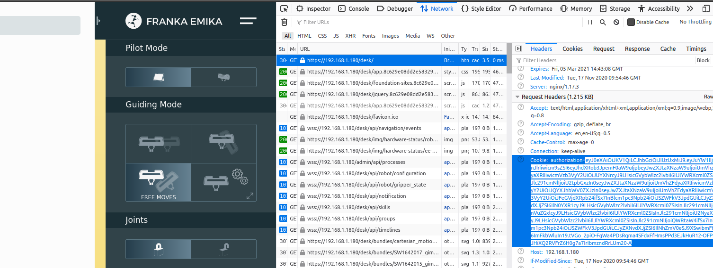
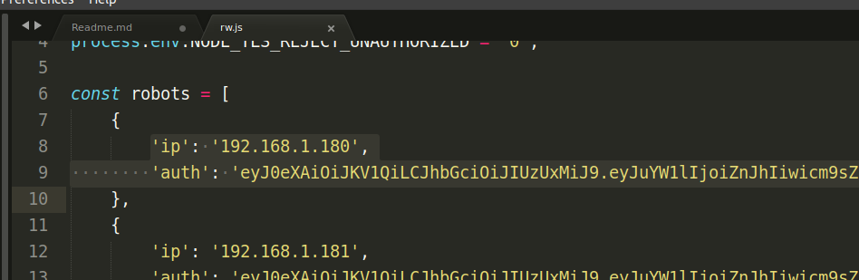

# Readout via Desk API

*Important: This was just a quick solution that we hacked together to record the robot positions for a single test that we performed. No guarantee about the correctness of the recorded information is made. Use at your own risk. The code is provided publicly here in case it might be useful to someone else.*

This project lets you continuously record the position of one or more [Franka Emika](https://www.franka.de/) Panda robots into a machine-readable JSON format, along with the current unix timestamp.

## Setup

Install node.js. On linux, node should be available from your package manager. For Windows, visit this website: https://nodejs.org/en/download/

To give the script access to your robot's API, you need to enter the ip address over which your robot is accessible in your network, along with the authentication cookie that is generated when you log in to Desk.

The value of the authentication cookie can be copied using your browser's DevTools. Press F12 to make the DevTools visible and switch to the "Network" tab. You might need to reload the page with the DevTools open for entries to appear here.



Edit the file "rw.js" and insert the ip address and the cookie value in the `robots` list.



You can enter the information for as many robots as you want here. The robots in this list are numbered starting from 0.

## Running

On Windows you should be able to set the robot number in a cmd window and then run the skript as follows:

```bash
set ROBOT=0
node rw.js
```

On Linux:

```bash
ROBOT=0 node rw.js # to record data from a single robot

./record_all.sh # to record from all listed robots
```

The output should look roughly like this, where `t` is a unix timestamp in milliseconds and `r` are the xyz coordinates in metres.

```json
{"t":1614362174047,"r":[0.39337407512874945,0.006562527751919063,0.31277178781395826]}
{"t":1614362174113,"r":[0.3933746854023975,0.006562122828487497,0.31277300679385944]}
{"t":1614362174174,"r":[0.3933746854023975,0.006562122828487497,0.31277300679385944]}
...
```
